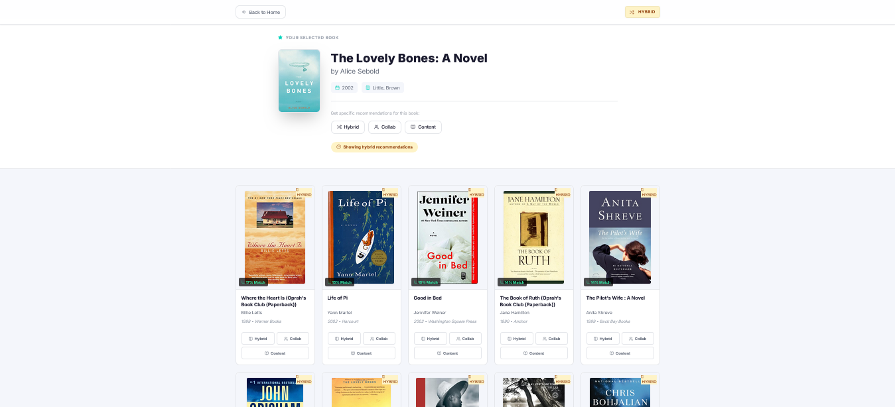
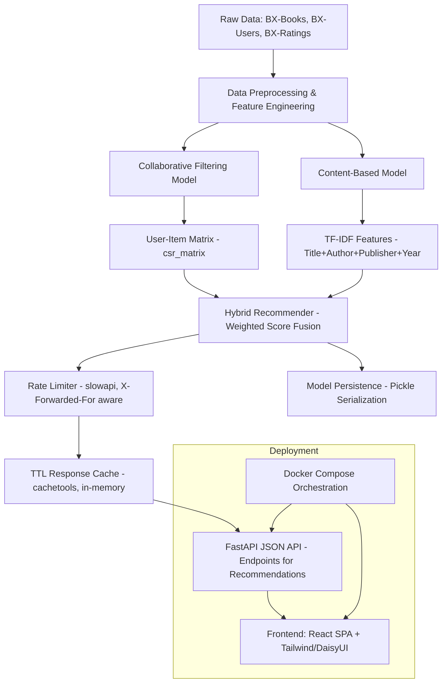

# **BookSage AI: hybrid book recommendation system**

<p align="center">
  <a href="https://scikit-learn.org/"></a>
  <a href="https://pandas.pydata.org/"></a>
  <a href="https://numpy.org/"></a>
  <a href="https://scipy.org/"></a>
</p>

<p align="center">
  <a href="https://fastapi.tiangolo.com/"></a>
  <a href="https://www.python.org/"></a>
  <a href="https://react.dev/"></a>
  <a href="https://vitejs.dev/"></a>
  <a href="https://tailwindcss.com/"></a>
  <a href="https://www.docker.com/"></a>
</p>

After finishing a book, most readers are stuck scrolling bestseller lists or wading through reviews, hoping something clicks. BookSage AI turns a book someone liked into a ranked list of others worth reading, by weighing what similar readers rated highly against what the book is actually about — its subject, author, and style. Every suggestion **shows the score behind it**, and if it doesn't recognize a title, it returns nothing rather than a fabricated guess. Built and tested to the same standard as **production software**, it's ready to sit inside a bookstore, library, or reading app as a real feature — not a weekend demo.

Under the hood, BookSage AI is a decoupled system — a **FastAPI** JSON API served independently from a **React 19** single-page app built with Vite and Tailwind/DaisyUI, talking to it only through a JSON API contract. Its recommendation core fuses a **scikit-learn** k-nearest-neighbors model over a SciPy sparse user-item matrix with a **TF-IDF**/cosine-similarity content model, combined through a configurable weighted-average fusion trained on the 1.1-million-rating Book-Crossing dataset. Both are wrapped in an in-memory **cachetools** TTL cache (no Redis required) and **slowapi** rate limiting, alongside pandas/NumPy preprocessing, pickled model persistence, structured logging, Framer Motion animations, and Docker images for each service orchestrated via docker-compose. A GitHub Actions pipeline enforces 100% backend coverage and a full frontend test suite on every push, so **the codebase can be extended or handed to a new team without the usual leap of faith**.

<div align="center">
  <video src="https://github.com/user-attachments/assets/648d13d4-12d7-4fbe-95ca-a7684430016f" width="100%" controls>
    Your browser does not support the video tag.
  </video>
</div>

<div align="center">
  
</div>

<div align="center">
  
</div>

---

## **Live Demo**

**Try the Hybrid Book Recommendation System live:** [https://booksage-ai.onrender.com/](https://booksage-ai.onrender.com/)

---

## **Core Technologies**

| **Category**                | **Technology / Resource**                                                                 |
| --------------------------- | ----------------------------------------------------------------------------------------- |
| **Core Language**           | Python 3.11                                                                               |
| **Backend Framework**       | FastAPI                                                     |
| **Data Processing**         | Pandas (Data Cleaning & Merging), NumPy (Matrix Ops)                                      |
| **Recommendation Models**   | **Hybrid System**: Collaborative Filtering + Content-Based Filtering                      |
| **Collaborative Filtering** | SciPy (`csr_matrix`), scikit-learn (`NearestNeighbors`)                                   |
| **Content-Based Filtering** | scikit-learn (`TfidfVectorizer`, `cosine_similarity`)                                     |
| **Hybrid Fusion Logic**     | Weighted average score combination                                                        |
| **Data Sources**            | Book-Crossing Dataset (`BX-Books`, `BX-Users`, `BX-Ratings`)                              |
| **Feature Engineering**     | TF-IDF on combined features (`title`, `author`, `publisher`, `year`)                      |
| **Model Persistence**       | Pickle (Model & Processed Data Serialization)                                             |
| **Memory System**           | In-memory caching of processed data (models) plus a TTL response cache (API layer)         |
| **Caching Layer**           | `cachetools` TTLCache, thread-safe in-memory response cache (no Redis)                     |
| **Rate Limiting**           | `slowapi` request throttling, `X-Forwarded-For`-aware client keying                        |
| **Evaluation Metrics**      | Popularity-based filtering, Active user filtering                                         |
| **Orchestration Layer**     | Modular service classes (`DataLoader`, `DataPreprocessor`, `ModelManager`, `HybridModel`) |
| **Frontend**                | React 19, Vite, Tailwind CSS, DaisyUI, Framer Motion                      |
| **Deployment**              | Docker (Python 3.11-slim base), `requirements.txt` dependency locking                     |
| **Portability**             | Pathlib-based cross-platform directory resolution                                         |
| **Error Handling**          | Graceful fallbacks & empty results handling                                               |

---

## **Comparison with Standard Systems**

| Feature | BookSage AI | Typical Recommenders |
|---------|------------|----------------------|
| Method Flexibility | 3 modes + hybrid tuning | Usually single-method |
| Cold Start Handling | Popular books fallback | Often fails |
| Explainability | Shows scores + metadata | Black-box results |
| UI Customization | Adjustable weights/counts | Fixed parameters |
| Response Caching | TTL in-memory cache on read endpoints | Often uncached or requires Redis |
| Abuse Protection | Per-client rate limiting (`slowapi`) | Frequently absent |

---

## **Project Structure**

```
BookSage-AI/
├── .github/
│   └── workflows/
│       └── main.yml             # CI/CD Pipeline tracking tests and linting
|
├── backend/                     # FastAPI Backend service
│   ├── app/                     # Core application package
│   │   ├── core/                # Configuration and system-wide utilities
│   │   │   ├── cache.py         # In-memory TTL response cache
│   │   │   ├── config.py
│   │   │   ├── logger.py
│   │   │   ├── models.py
│   │   │   └── __init__.py
│   │   ├── data/                # Raw book-crossing dataset (CSV)
│   │   │   ├── BX-Book-Ratings.csv
│   │   │   ├── BX-Books.csv
│   │   │   └── BX-Users.csv
│   │   ├── logs/                # Application runtime logs
│   │   │   └── app.log          # System execution log file
│   │   ├── models/              # Pickled ML models and processed data
│   │   │   ├── book_pivot.pkl
│   │   │   ├── books_content.pkl
│   │   │   ├── books_data.pkl
│   │   │   ├── cb_model.pkl
│   │   │   ├── cf_model.pkl
│   │   │   ├── content_sim_matrix.pkl
│   │   │   ├── final_rating.pkl
│   │   │   ├── tfidf_vectorizer.pkl
│   │   │   └── title_to_idx.pkl
│   │   ├── services/            # Recommendation engine components
│   │   │   ├── collaborative_model.py
│   │   │   ├── content_model.py
│   │   │   ├── data_loader.py
│   │   │   ├── data_preprocessor.py
│   │   │   ├── hybrid_model.py
│   │   │   ├── model_manager.py
│   │   │   ├── recommendation_engine.py
│   │   │   └── __init__.py
│   │   ├── main.py              # Application entry point (FastAPI)
│   │   └── train_models.py      # Script to retrain recommendation models
│   ├── tests/                   # Backend testing suite
│   │   ├── conftest.py
│   │   ├── test_cache.py        # TTL cache unit tests
│   │   ├── test_collaborative_model.py
│   │   ├── test_config.py
│   │   ├── test_content_model.py
│   │   ├── test_data_loader.py
│   │   ├── test_data_preprocessor.py
│   │   ├── test_endpoints.py    # API endpoint tests (100% coverage)
│   │   ├── test_hybrid_model.py
│   │   ├── test_logger.py
│   │   ├── test_model_manager.py
│   │   ├── test_models.py
│   │   ├── test_rate_limit.py   # slowapi rate limiting tests
│   │   ├── test_recommendation_engine.py
│   │   └── __init__.py
│   ├── Dockerfile               # Backend containerization
│   ├── pyproject.toml           # Backend build and lint config
│   ├── requirements.txt         # Backend Python dependencies
│   ├── run.py                   # Service-level runner
│   └── setup.py                 # Backend package installation
|
├── frontend/                    # React SPA (Vite + Tailwind + DaisyUI)
│   ├── public/                  # Public static assets
│   ├── src/                     # Source code
│   │   ├── components/          # Reusable UI components
│   │   │   ├── Background.js
│   │   │   ├── BookCard.js
│   │   │   ├── BookCard.test.js # Frontend unit tests
│   │   │   ├── Hero.js
│   │   │   └── Hero.test.js
│   │   ├── App.css
│   │   ├── App.js               # Main application logic
│   │   ├── App.test.js
│   │   ├── index.css
│   │   ├── index.js
│   │   ├── reportWebVitals.js
│   │   └── setupTests.js        # Vitest environment setup
│   ├── Dockerfile               # Multi-stage production build (Nginx)
│   ├── package.json             # Frontend dependencies and scripts
│   ├── tailwind.config.js       # UI Design configuration
│   ├── vite.config.js           # Frontend build tool config
│   └── vitest.config.js         # Frontend testing configuration
|
├── notebooks/                   # Research and experimental notebooks
│   └── experiment.ipynb         
|
├── .gitignore                   # Project-wide ignore rules
├── app.png                      # Demo picture
├── app-1.png                    # Demo picture
├── demo.mp4                     # Demo video
├── docker-compose.yml   
├── LICENSE   
├── README.md                    # Project documentation
├── render.yml                   # Production deployment config
└── run.py                       # local runner for backend and frontend
```

---

## **Architecture Diagram (Mermaid)**


---

## Quick Start (Automated)

### Prerequisites

- Python 3.10+
- Node.js & npm

### One-Click Setup & Run

The project includes an intelligent launcher that automatically handles dependency installation for both the backend and frontend.

```bash
# Clone the repository
git clone https://github.com/Md-Emon-Hasan/BookSage-AI.git
cd BookSage-AI

# Run the automated setup and launcher
python run.py
```

> The script will automatically detect if `node_modules` or Python packages are missing and install them for you before starting the services.

### Running the Application

#### **Local Development (Simultaneous)**
Use the unified local runner at the project root to start both services:
```bash
cd BookSage-AI
python run.py
```
*   **Backend**: `http://127.0.0.1:8000`
*   **Frontend**: `http://localhost:5173` (with API proxy to 8000)

#### **Individual Services**
```bash
# Backend only
cd backend && python run.py

# Frontend only
cd frontend && npm run dev
```

---

## API Endpoints (FastAPI)

| Method | Endpoint | Description | Rate Limit | Cache TTL |
|--------|----------|-------------|------------|-----------|
| GET | `/api/popular` | Get popular books (JSON) | 60/minute | 24h (86400s) |
| POST | `/api/recommend` | Get book recommendations (JSON) | 30/minute | 1h (3600s) |
| GET | `/api/search_books` | Search books by title (JSON) | 60/minute | 1h (3600s) |
| GET | `/api/health` | Health check endpoint | None | Not cached |

## Caching & Rate Limiting

**Configuration** (`backend/app/core/config.py`), all optional with sensible local-dev defaults:

| Variable | Default | Purpose |
|----------|---------|---------|
| `CACHE_ENABLED` | `True` | Master on/off switch for response caching |
| `CACHE_TTL_SECONDS` | `3600` | TTL for `/api/recommend` and `/api/search_books` |
| `CACHE_MAXSIZE` | `1000` | Max entries per cache bucket before LRU-style eviction |
| `POPULAR_CACHE_TTL_SECONDS` | `86400` | TTL for `/api/popular` (effectively static data) |
| `RATE_LIMIT_ENABLED` | `True` | Master on/off switch for rate limiting |
| `RATE_LIMIT_RECOMMEND` | `"30/minute"` | Limit applied to `POST /api/recommend` |
| `RATE_LIMIT_SEARCH` | `"60/minute"` | Limit applied to `GET /api/search_books` |
| `RATE_LIMIT_POPULAR` | `"60/minute"` | Limit applied to `GET /api/popular` |

**429 behavior.** Exceeding a limit returns HTTP 429 with a `Retry-After` header and a clean JSON body:

```json
{ "detail": "Rate limit exceeded. Please try again shortly." }
```

The event is also logged through the project's existing logger for observability.

## Docker

```bash
# Build and run
docker-compose up -d

# View logs
docker-compose logs -f

# Stop
docker-compose down
```

## Testing & Quality Assurance

### Backend (Pytest)
```bash
# Run all backend tests
cd backend && pytest tests/ -v

# Run with coverage (100% Target)
pytest tests/ -v --cov=app --cov-report=term-missing
```

### Frontend (Vitest)
```bash
# Run all frontend tests
cd frontend && npm test

# Run with coverage
npm run test:coverage
```

### CI/CD Pipeline
Our GitHub Actions pipeline (`.github/workflows/main.yml`) automatically performs the following on every push:
1. **Linting**: flake8 and isort for backend, ESLint for frontend.
2. **Backend Testing**: Runs full suite with 100% coverage requirement.
3. **Frontend Testing**: Runs Vitest suite for component integrity.
4. **Docker Build**: Verifies that both services build correctly.

---
  
**Prepared by:**  

**Md Emon Hasan**  
**Email:** [emon.mlengineer@gmail.com](mailto:emon.mlengineer@gmail.com)  
**Portfolio:** [Md-Emon-Hasan](https://emonlabs-ai.hitechparks.com/)  
**WhatsApp:** [+8801834363533](https://wa.me/8801834363533)  
**GitHub:** [Md-Emon-Hasan](https://github.com/Md-Emon-Hasan)  
**LinkedIn:** [Md Emon Hasan](https://www.linkedin.com/in/md-emon-hasan-695483237/)  
**Facebook:** [Md Emon Hasan](https://www.facebook.com/mdemon.hasan2001/)
